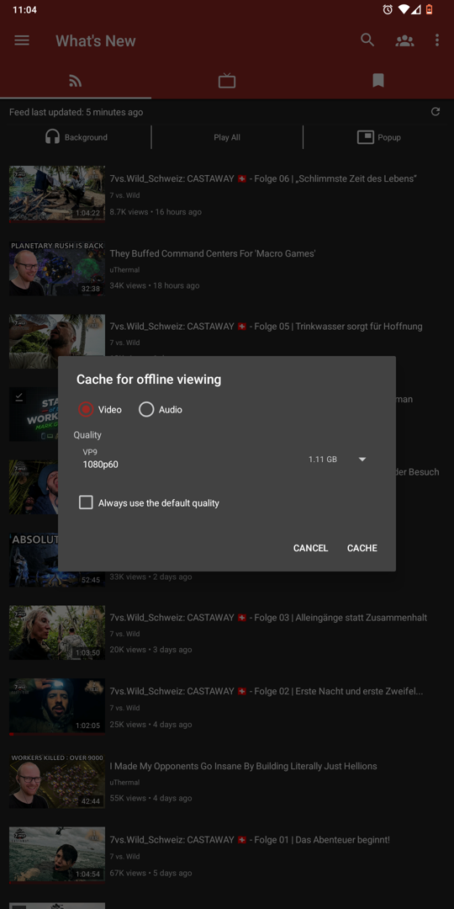
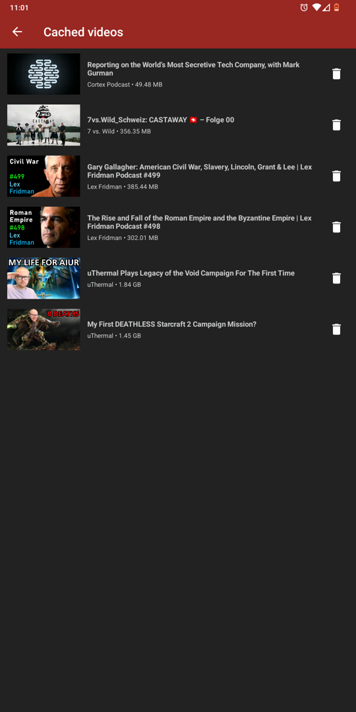
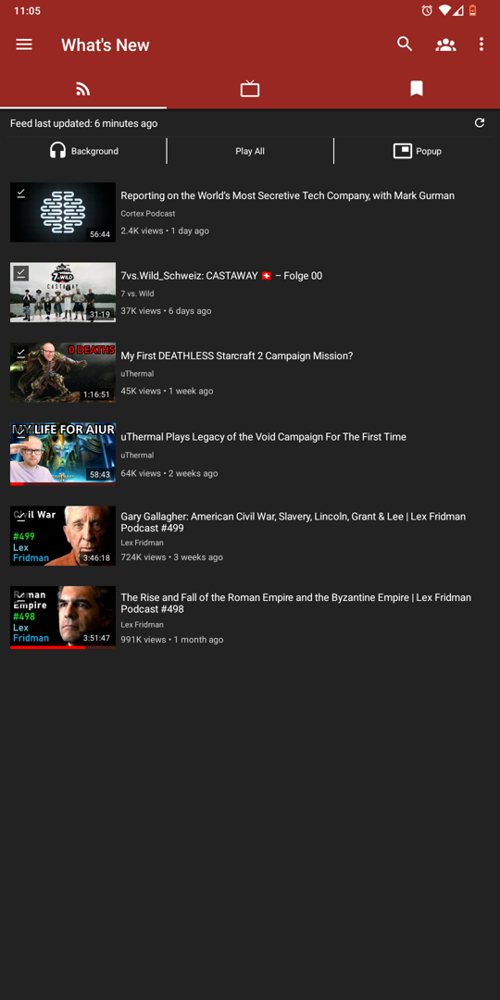
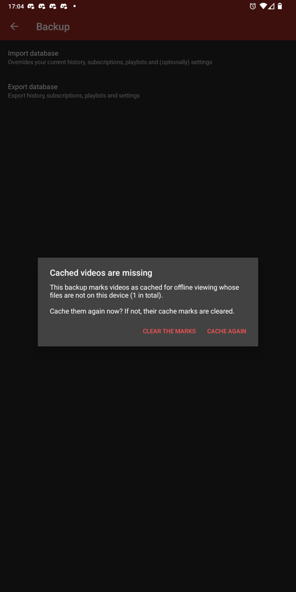
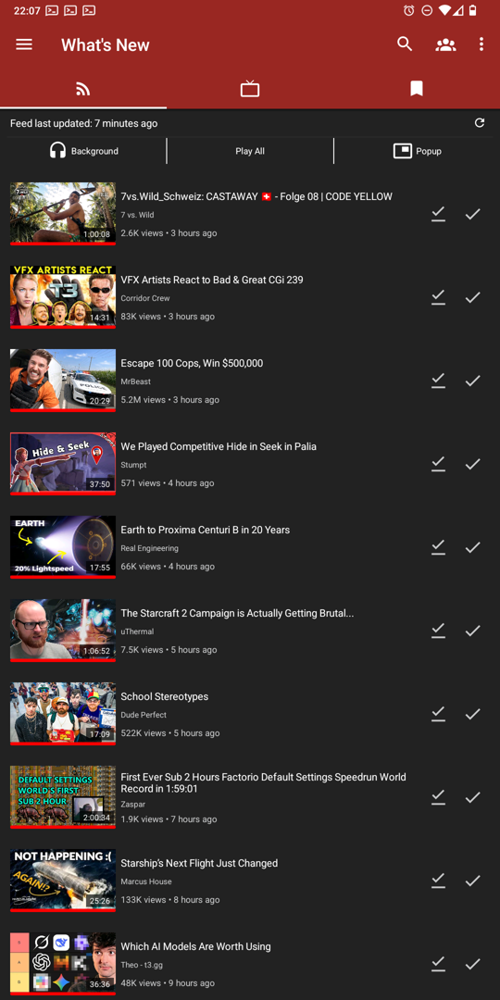
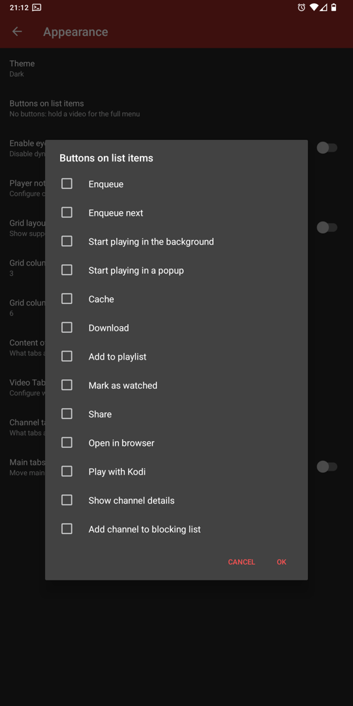
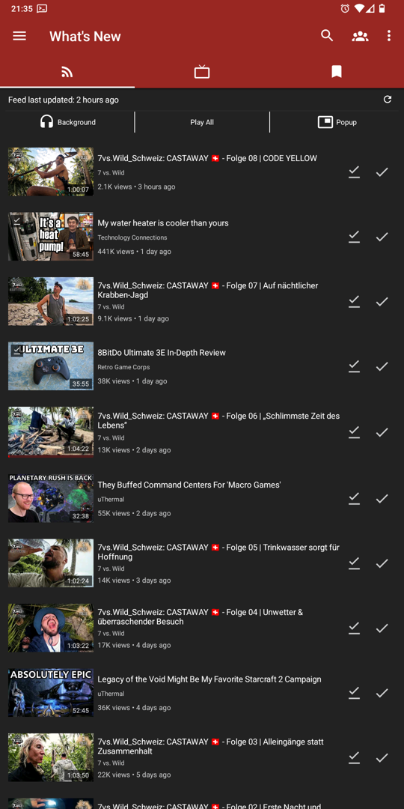
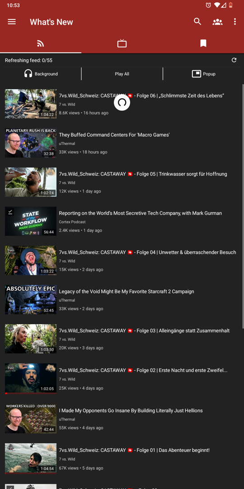
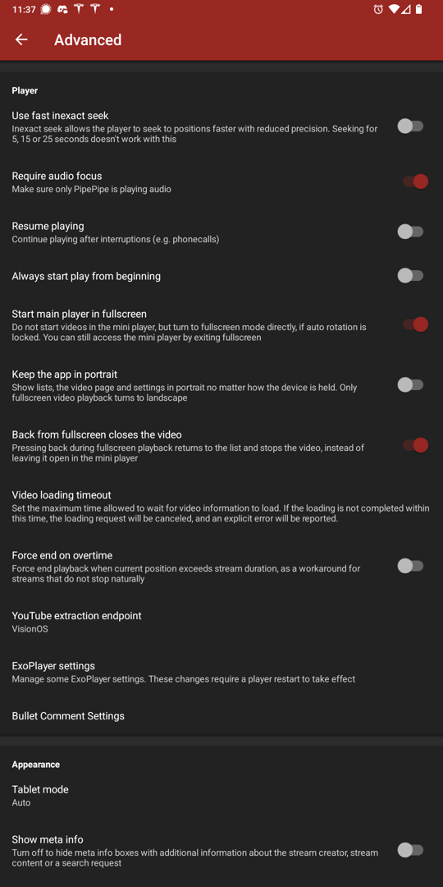

<h2 align="center"><b>PipePipe — vibecoded fork</b></h2>
<h4 align="center">A soft fork of PipePipe. Every feature below was written by an AI coding agent on request, then tested on a real phone.</h4>

## What this is

This is a fork of [PipePipe](https://github.com/InfinityLoop1308/PipePipe) by
[@InfinityLoop1308](https://github.com/InfinityLoop1308), which is itself a fork of NewPipe. The
upstream project is not interested in merging these changes, so they are kept here instead.

**Vibecoded** is meant literally: each feature started as a sentence or two of description, was
implemented by [Claude Code](https://claude.com/claude-code) working in this repository, and was
then exercised on a physical device — a rooted OnePlus 5T on LineageOS 19.1 — before it counted as
done. Screenshots on this page are from that phone. Bugs in this fork are the fork's own; please
don't take them to upstream.

The app code lives in [ArnoldSmith86/PipePipeClient](https://github.com/ArnoldSmith86/PipePipeClient).
Its **`dev`** branch carries everything described here, on top of upstream's `dev`.

## What the fork adds

### Cache videos for offline viewing

A video can be kept on the device and watched with no connection at all, and thrown away again when
it has been watched. It is a companion to the existing Download feature rather than a replacement:
downloads are permanent files you export to your own storage, a cached video is app-private, listed
on its own screen, and meant to be temporary. Caching runs the same download engine as Download, so
anything the app can download it can cache — SABR, HLS and DASH streams included — with a quality
selector, or straight at the default quality if you turn that on in *Settings → Download →
Caching*. The player, the video page, the feed and every list know about it: a cached video plays
from disk instead of being re-fetched, list items carry an "available offline" badge, the feed can
be filtered down to cached videos only, and a video that has been watched to the end offers an
Uncache button in the player.

Importing a backup notices the difference between what the database claims and what is on the disk:
a backup carries the database but never the media, so it asks whether the videos it lists should be
cached again or have their marks cleared, then reconciles the table against the cache directory —
dropping rows with no files, repairing rows whose files moved (a backup from another device), and
deleting folders no row points at.

*Branch: `feature/cache-for-offline-viewing` · [issue #2782 upstream](https://github.com/InfinityLoop1308/PipePipe/issues/2782)*

### The feed stops showing stale data

The feed used to read its videos once per refresh, so watch state changes never reached it:
finishing a video left the red position bar where it was, and marking a video as watched while
played items were hidden left it sitting in the list until something else forced a reload. The feed
now subscribes to the database instead of reading it once, so those changes appear as they happen —
watched videos disappear under the "hide watched" filter, position bars move, and deleting a history
entry clears the bar. Rebuilds are throttled and identical results dropped, so watching a video
doesn't rebuild the list every few seconds, and the scroll position is kept — except when you change
the watched-items filter, where the list now takes you to the top of the new list instead of leaving
the newest videos off screen above you.

*Branch: `feature/feed-live-updates`*

### Buttons on list items

The long-press menu on a video holds a dozen entries, and most people use two or three of them
constantly. *Settings → Appearance → Buttons on list items* takes any combination of those entries
and puts them as icon-only buttons at the end of every video row — in the feed, in search, on
channels and playlists, in history and local playlists, across the list, grid and card layouts. A
button runs exactly the entry it names, so there is one implementation of "share this" and the
button is just a second way to reach it. Entries that only work inside a particular dialog (Delete,
Set as playlist thumbnail) are not offered. Off by default.

*Branch: `feature/list-quick-actions`*

### Feed refresh that doesn't blank the list

Refreshing the subscription feed used to replace the whole screen with a spinner, so a refresh that
outlived the screen — coming back from a video, for instance — left you looking at a loading state
instead of the feed you had. The list now stays where it is while a refresh runs and the progress
goes into the "Feed last updated" line. The blocking spinner is still used for the one case that
needs it: the very first load, when there is nothing to keep on screen.

*Branch: `feature/feed-refresh-non-blocking`*

### Keep the app in portrait

Rotating the phone to watch something fullscreen used to leave the whole app in landscape
afterwards: lists, the video page and the settings screens all stayed sideways, and on a device
that reports as a tablet the code paths that give the orientation back were skipped entirely. The
fork releases the orientation the app pinned whenever it leaves fullscreen, and adds *Settings →
Advanced → Keep the app in portrait* for people who want everything except fullscreen playback to
stay upright regardless of how the device is held.

*Branch: `feature/rotation-restore-portrait`*

### Back from fullscreen closes the video

With *Settings → Advanced → Back from fullscreen closes the video* on, pressing back during
fullscreen playback returns to the list you came from and stops the video, instead of dropping it
into the mini player to keep playing. Off by default.

*Branches: `feature/back-from-fullscreen-closes-player`, `feature/rotation-restore-portrait`*

### Seek bar clear of the system gesture strip

On a phone with gesture navigation, the player's seek bar sits exactly where the system's back and
home swipes live, so scrubbing near the bottom of the screen fights the navigation gestures. The
bottom controls are now padded up by the system gesture inset, with a floor of 24 dp and a ceiling
of 48 dp, and the padding is re-applied on layout changes because the insets are unknown on the
first pass and change with fullscreen and orientation.

*Branch: `feature/seekbar-gesture-clearance`*

## Translations

Strings these features add are translated into the 72 locales upstream actually maintains. The
translations are machine-produced and unreviewed, so corrections are welcome; locales that upstream
ships nearly empty were deliberately left to fall back to English rather than be filled with
unreviewed text.

## How the branches are laid out

Each feature is its own branch off upstream's `dev`, and `dev` in this fork is the integration
branch that merges all of them — it is what gets built and installed. Feature branches are rebased
onto upstream `dev` rather than having it merged into them, so each one stays a readable set of
changes against upstream.

## Builds

Debug APKs are published under [Releases](https://github.com/ArnoldSmith86/PipePipe/releases) on
this repository, the way upstream does it — the code lives in the client repository, the builds
live here. They
are signed with a local debug key, so they cannot be installed over an official PipePipe build —
the two can live side by side, since the debug build uses its own application id.

To build it yourself, clone `PipePipeClient` next to `PipePipeExtractor` and run
`./gradlew :app:assembleDebug`.

## Upstream

Everything this fork does not touch is upstream's work. PipePipe is on
[F-Droid](https://f-droid.org/packages/InfinityLoop1309.NewPipeEnhanced/) and
[IzzyOnDroid](https://apt.izzysoft.de/fdroid/index/apk/InfinityLoop1309.NewPipeEnhanced), and if you
find it useful, the donation links belong to its author:
[Liberapay](https://liberapay.com/PipePipe) · [Ko-fi](https://ko-fi.com/pipepipe).

Upstream's own notes worth repeating: PipePipe uses a login cookie only for the scenarios you set
under "Cookie Functions" — for YouTube, only when retrieving playback streams. The
[PipePipe Wiki](https://priveetee.github.io/Docs-PipePipe) is maintained by
[@Priveetee](https://github.com/Priveetee), who also researched SABR support, and
[@AioiLight](https://github.com/AioiLight) provided parts of the NicoNico service.

## Issues

Issues about the features above belong here. Anything else — playback, extraction, services —
belongs [upstream](https://github.com/InfinityLoop1308/PipePipe/issues), and please reproduce it on
an official build first.
